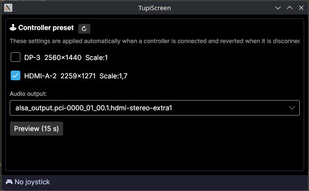

# TupiScreen

A lightweight system tray utility for Linux that automatically switches your display layout and audio output when a game controller is connected, and reverts everything when it is disconnected.

## Screenshot



## Features

- **Auto-apply on connect** — saves your current display/audio state, then applies your configured preset the moment a controller is detected.
- **Auto-revert on disconnect** — restores the previous display layout and audio sink when the controller is unplugged.
- **Crash recovery** — if the app is closed or the machine restarted while a controller preset is active, TupiScreen reverts the settings on its next launch.
- **Preview mode** — try your preset for 15 seconds and have it revert automatically (or press *Revert* to cancel early).
- **System tray integration** — runs quietly in the background; double-click the tray icon to open the settings window.

## Requirements

- Linux with KDE Plasma (uses `kscreen-doctor`)
- `pactl` (PipeWire / PulseAudio) for audio switching
- No .NET runtime needed — the published binary is a native AOT executable

## Installation

**From the AUR** (Arch Linux):

```bash
# with an AUR helper
paru -S tupiscreen

# or manually
git clone https://aur.archlinux.org/tupiscreen.git
cd tupiscreen && makepkg -si
```


## Building

For local development:

```bash
dotnet build
```

To publish a native AOT binary (no .NET runtime required on the target machine):

```bash
dotnet publish -c Release -r linux-x64
```

The output lands in `bin/Release/net10.0/linux-x64/publish/`. Copy `TupiScreen`, `libSkiaSharp.so`, and `libHarfBuzzSharp.so` to the target machine — that's all you need.

## Usage

1. Run `TupiScreen` — it starts minimised to the system tray.
2. Open the settings window by clicking the tray icon.
3. Select which displays should be **enabled** and which **audio output** should be active while the controller is connected.
4. Click **Preview (15 s)** to test the preset without waiting for a controller.
5. Plug in your controller — TupiScreen applies the preset automatically.
6. Unplug the controller — everything reverts to how it was before.

## License

MIT
